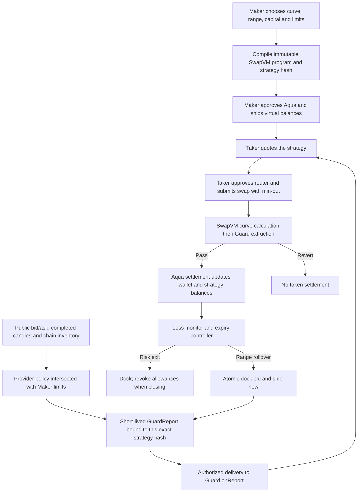

# Aqua flow and current CLMM support

Verified against the local main repository and Ethereum Sepolia evidence on 2026-09-12.

## Liquidity and authorization are separate

This diagram is the intended full flow. The repository has implementations and tests for its components; real confidential execution and delivery across the whole path are not yet proven.

1. **Maker prepares liquidity.** The compiler selects XYC, PeggedSwap or a concentrated range and commits its bounds, expiry, salt and Guard envelope into `strategyHash`. Maker approves **Aqua** to move the relevant tokens, then calls `ship`. Ship records virtual balances; it does not deposit or transfer the Maker's WETH/USDC. Actual funds and sufficient allowance must still exist when a taker trades. A wallet can back several strategies, so its balance is not the same as any one strategy's allocation. See [executor](../contracts/aqua-executor/src/executor.ts).
2. **Workflow decides which trades are allowed.** Provider conditions and Maker budget, inventory, per-fill and TTL limits intersect to produce a public report. The report binds chain, Guard, router, maker, token pair and exact strategy hash. The proposed confidential workflow keeps private inputs within the TEE. [Current public market adapter](../workflow/src/market-observation.ts) validates ETH/USDC midpoint, a defined 30-minute volatility measure and finalized maker wallet balances before feeding the [existing evaluator](../workflow/src/intersect.ts). These wallet balances do not replace Guard V2's actual Aqua strategy inventory checks.
3. **Delivery updates Guard state.** `onReport` accepts only the configured forwarder and workflow identity/profile, checks nonce and lifetime, and stores the report. Current Guard V2 supports one active strategy hash per maker: an enabled report for B replaces A; a paused report only clears itself if currently active. This is a separate action from Aqua `dock`/`ship`. [Guard source](../contracts/aqua-executor/contracts/AquaGuardV2.sol).
4. **Each trade is gated.** A taker quotes, approves the **router**, then submits an exact-input swap with a minimum output. SwapVM computes the curve output and calls the terminal Guard extruction before settlement. Guard checks active hash, time, pair, direction, fill caps and real post-trade inventory. Quotes and swaps both fail if the gate reverts. Passing preserves VM registers. Aqua settlement transfers tokens between maker and taker and updates its bookkeeping; a reverted swap still consumes the taker's gas.
5. **Monitor and exit.** The loss monitor compares strategy value against the original HODL baseline and requests `dock` on a threshold breach; this is a reactive exit, not a guaranteed maximum loss. Concentrated autopilot can renew/recenter only once the old program deadline has strictly expired, with cooldown, range and rollover-count controls. It carries existing inventory and preserves the original HODL baseline. A new program hash needs a new report before trading resumes. Closing can dock and revoke allowances. No persistent controller is started by the read-only CRE snapshot.

The deployed router is pinned to swap-vm v1.0.2 commit `32c687c2b73101fc26549e48fa1ff8a4d73afbac` with SDK 0.4.4. Its opcode table differs from upstream main; do not use main's extruction index to assemble programs for this router.

## LP support

| Program | Implemented behavior | Evidence / limits |
|---|---|---|
| XYC | Constant-product pricing; compile, ship, swap, atomic replacement, monitor and dock | Local tests and Sepolia lifecycle records |
| PeggedSwap | Reference balances/rates and a configurable near-peg curve | Real-router local tests, including 6/18 decimals and Guard veto; no public PeggedSwap demo claimed |
| Concentrated | One bounded price interval per strategy; human price/decimal conversion; Guard V2 uses real inventory | Local tests and Sepolia concentrated swaps plus a mined rejected swap |
| Concentrated autopilot | Expiry rollover, range recentering, durable recovery, HODL loss monitor | Local integration tests; new hash waits for a new report |

**CLMM is supported as Aqua/SwapVM single-range liquidity.** It does not include a Uniswap V3 multi-tick pool, NFT positions or Uniswap fee-collection APIs. Both starting token balances must be positive; one-sided inventory needs manual handling. The controller does not swap inventory back to a desired ratio. Curve spot depends on inventory and bounds, so choosing an oracle-centered range alone does not guarantee matching the oracle price. Guarded templates currently require zero fees; regular templates have fee support.

The frontend has a CLMM authoring template in [aquaTemplates.ts](../frontend/src/app/marketplace/aquaTemplates.ts). Those UI templates are not proof of deployed strategies or a verified one-click frontend lifecycle. [LP configuration and execution details](../contracts/aqua-executor/docs/LP-STRATEGIES.md).

## What has actually been verified

- **Public testnet settlement:** Ethereum Sepolia canonical WETH and Circle USDC; [concentrated success](https://sepolia.etherscan.io/tx/0x09b2a866a41dfbdccf0730fa07e6c88bd121e6a5b7fc099f8957e8c529b72ea8) and [expected rejection](https://sepolia.etherscan.io/tx/0x8a91c65378536ef42c80221e4a031476c31fe8bf570f8728fa7feef3d81b6072). These used synthetic reports and a separate test receiver. The completed demo docked its strategies and revoked allowances; it is historical evidence, not a continuously running LP.
- **Current receiver:** [deployment bundle](../contracts/aqua-executor/deployments/11155111.json) points to Guard V2 `0x64f6e18e85dae5ec2ee44fe7f9fc66cf2a1f056f`, revision `maker-active-v1`, **CRE simulation** profile. [Replacement deployment proof](../contracts/aqua-executor/docs/ethereum-sepolia-guard-revision.json). Do not reuse the older `0x51c4…356e` receiver for Maker-scoped switching.
- **Current CRE work:** CLI login, hello-world and real HTTP/Sepolia read-only local simulation are verified. The main confidential handler now obtains live observations and calls the shared report delivery adapter. A [subsequent Sepolia run](../workflow/verification/live-market-guard/README.md) verifies actual CRE CLI simulation broadcasts to the current receiver, followed by a successful CLMM trade and a mined direction rejection. Inputs were public synthetic policies. This does not attest a real TEE. The separate local preview still uses an unshipped hash and does not deliver anything.
- **Maker A/B switching:** the current main branch separately records successful swaps on both provisioned strategies and an inactive-strategy rejection in the [executor evidence](../contracts/aqua-executor/README.md). This is distinct from the single-strategy live-acquisition run above.
- **Still to verify:** automatic frontend/runner onboarding of a new Provider publication, actual DON deployment and confidential TEE delivery. The [versioned CLMM integration](LP-RELEASES.md) supplies the publication/compiler boundary and expiring readiness, with manual Maker provisioning still required. CLI simulation, DON deploy access and Confidential Workflows enrollment are separate states.

Upstream semantics: [Aqua lifecycle](https://github.com/1inch/aqua), [pinned concentration math](https://github.com/1inch/swap-vm/blob/32c687c2b73101fc26549e48fa1ff8a4d73afbac/src/instructions/XYCConcentrate.sol). Market data: [Kraken order book](https://docs.kraken.com/api-reference/market-data/get-order-book), [Kraken OHLC](https://docs.kraken.com/api-reference/market-data/get-ohlc-data). Kraken's current unfinished candle is excluded from the volatility window.
