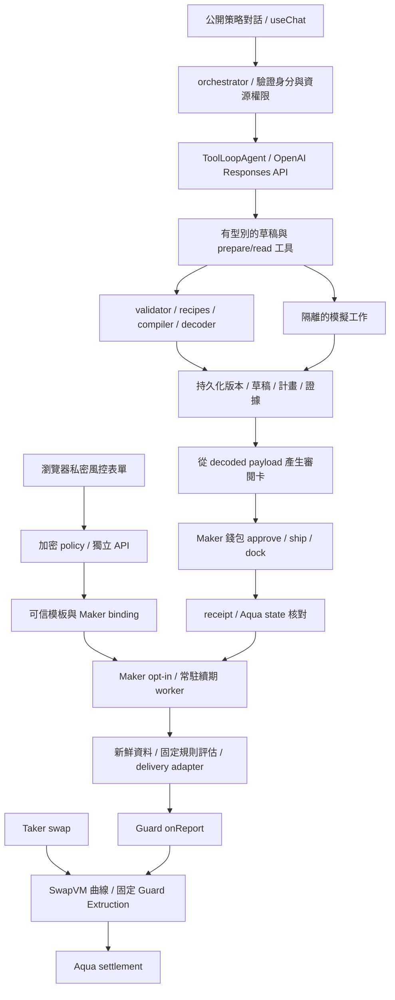

# Builder：OpenAI API 與 Vercel AI SDK 整合提案

> **後續修正（2026-09-13，main `1d7f6a2`）**：使用者指定改用事件觸發。以下保存 `10a494e` 時點的第二輪提案，OpenAI/AI SDK 和公開／私密資料隔離設計仍適用；TTL 續期部分以 [事件觸發研究](SWAPVM-BUILDER-EVENT-TRIGGERS.md) 及 [最新 handoff](SWAPVM-STRATEGY-BUILDER-HANDOFF.md) 為準。新 Guard 支援 standing report，main 已完成相同條件不發 report、GET 不觸發評估、以鏈上 nonce 修正順序重評。新的工作是 event subscriptions/outbox/evaluation queue、可信 binding 與持續撤銷介面，不是固定時間刷新 report。服務故障時舊授權不會自然到期；本文第 7 節的 TTL fail-closed 假設已失效。AI 不參與 runtime 事件評估。資料庫改存事件與評估工作；`renewal` 命名是歷史提案，尚無既有 API 需要維持相容。

研究日期：2026-09-13（Asia/Taipei）。本機基準 `main / 10a494e`。
本文件是第二輪實作研究，**沒有安裝依賴、呼叫付費模型、修改應用程式或執行鏈上交易**。
需求以 [handoff](SWAPVM-STRATEGY-BUILDER-HANDOFF.md)、[原始規格](strategy-builder-research/original-spec.txt) 及後續已確認選擇為準。

使用者本輪指定：主要模型服務用 **OpenAI API**，agent 框架簡單使用 **Vercel AI SDK**。以下套件、模組和 API 路徑是實作提案，尚未建立；不將建議記成已取得的外部服務或已完成的功能。

後續更新：使用者已指定 Railway PostgreSQL，instance 已建立並通過 SQL 連線驗證，見 [資料庫紀錄](BUILDER-DATABASE.md)。以下其餘應用程式設計仍為提案。

## 1. 建議架構

採單一 Builder agent，依 Provider/Maker 階段給不同工具集合；底層由確定性程式執行驗證、編譯和模擬。AI SDK 負責模型呼叫、工具迴圈和前端串流，不持有業務狀態的唯一副本。



既有前端使用 Next 靜態匯出；AI 串流仍走獨立 orchestrator，無須為了 AI SDK 搬到 Vercel hosting 或改成 Next server actions。`@ai-sdk/openai` 直接使用 OpenAI provider，模型 ID 從服務端設定載入；不以 provider/model 字串意外走預設 Gateway。[OpenAI provider](https://ai-sdk.dev/providers/ai-sdk-providers/openai)、[chat transport](https://ai-sdk.dev/docs/ai-sdk-ui/transport)。

## 2. 這次找到的具體缺口

| 現況與原始碼 | 實作影響 |
|---|---|
| `frontend/next.config.ts` 為 `output: 'export'`；舊 `ChatPanel.tsx` 是 canned Solana 互動 | 新 Builder 使用獨立 React 元件、`useChat`、`DefaultChatTransport` 指向 orchestrator |
| `orchestrator/src/server.mjs` 是 `node:http`、CORS 只接受 `content-type` | 可用官方 `pipeAgentUIStreamToResponse` 直接接 `ServerResponse`；新增 auth header、stream error/abort 處理，不必再引入 HTTP framework |
| `orchestrator/Dockerfile` 是 Node 20；package engines 也是 >=20 | 若採下列 SDK 7 組合，部署 runtime 必須更新；本機 Node 24 已足夠 |
| frontend React/ReactDOM 都是 19.1.0 | 不符合查得的新版 `@ai-sdk/react` peer range；需一起升相容修補版本並跑前端驗證 |
| `compileGuardedV2()` 只接受 concentrated，template marker 亦只列該 V2 recipe | XYC/Pegged 不能只移除一個判斷就宣稱支援；需 recipe、marker、decoder、real-router/Guard V2 測試一起補 |
| `service.get()` 呼叫 runner；runner 可能送 report | Builder GET 必須純讀；授權及續期改由明確 action/worker 觸發 |
| runner catalog 綁固定 hash；workflow `providerBindings` 也綁固定 `strategyHash` 與 envelope hash | 自動 Maker onboarding 要同時更新可信 registry 和 delivery 邊界，單改前端無法完成 |
| workflow 使用 `nonce: BigInt(nowSec)` | 首版續期須補持久化 report nonce 與 request correlation；單純 backend 排程不會自動解決 |
| 目前 registry/mandate 主要是 JSON files，舊 Supabase 路徑服務 Solana workflows | 不能直接假設已有 Ethereum Builder 的跨使用者權限和併發資料模型 |
| compiler 使用 Node `createRequire`，讀取 executor artifacts | AI SDK 7 的 ESM 與既有 SDK CJS adapter 應隔離；Docker 也需包含純編譯 adapter 所需依賴與 artifacts |

## 3. SDK 與版本核對

直接讀 npm registry metadata 與發布包的 TypeScript declaration；沒有執行套件 install scripts。這是選版證據，**不是安裝/build 相容性已測通**。

| 套件 | 2026-09-13 查得 stable | 重要條件 |
|---|---|---|
| `ai` | `7.0.99` | Node >=22；Zod `^3.25.76 || ^4.1.8` |
| `@ai-sdk/openai` | `4.0.66` | Node >=22；同一代 provider 介面 |
| `@ai-sdk/react` | `4.0.102` | 依賴 `ai: 7.0.99`；React `^18 || ~19.0.1 || ~19.1.2 || ^19.2.1` |
| `zod` | `4.6.2` | 可作新增 Builder schema 的候選；不因此升級既有 CRE workspace |

版本來源：[ai registry](https://registry.npmjs.org/ai/7.0.99)、[OpenAI adapter registry](https://registry.npmjs.org/@ai-sdk%2fopenai/4.0.66)、[React adapter registry](https://registry.npmjs.org/@ai-sdk%2freact/4.0.102)、[Zod registry](https://registry.npmjs.org/zod/4.6.2)。實作時鎖定驗證通過的 exact versions 和 pnpm lockfile，不留 `latest`。

特別注意搜尋結果可能仍是 SDK 5/6：本次 SDK 7 declaration 和即時文件使用 **`isStepCount`**，不是舊教學的 `stepCountIs`。SDK 7 要用 ESM。[AI SDK 7 release](https://vercel.com/changelog/ai-sdk-7)、[Building agents](https://ai-sdk.dev/docs/agents/building-agents)。

Agent 設定骨架如下。`createBuilderTools`、`scopedService`、`publicInstructions` 是本專案待實作元件，這段不是已測通的 Builder：

```ts
import { ToolLoopAgent, isStepCount } from 'ai';
import { openai } from '@ai-sdk/openai';

const agent = new ToolLoopAgent({
  model: openai.responses(modelId), // 服務端設定並驗證帳號可用的模型
  instructions: publicInstructions,
  tools: createBuilderTools(scopedService),
  stopWhen: isStepCount(6), // 首輪建議上限，可依 eval 調整
  providerOptions: {
    openai: { store: false, parallelToolCalls: false },
  },
});
```

每個工具用 `tool({ inputSchema, strict: true, execute })`。模型輸入 schema 保持簡單，只表示 patch 意圖；完整 bigint/跨欄位/能力/權限驗證在 domain service 執行。OpenAI strict schema 要求 object 不接受額外欄位，properties 全列 required；可選語意用明確操作或 nullable 表達，不能把任意 `.optional()`/Zod refinement 當作模型端完整驗證。[OpenAI function calling](https://developers.openai.com/api/docs/guides/function-calling)、[AI SDK tool calling](https://ai-sdk.dev/docs/ai-sdk-core/tools-and-tool-calling)。

模型先採服務端單一可設定 ID，不自行切換模型或 provider。接入時用繁中修改草稿、缺參數、拒絕不支援需求、工具正確率評估，再決定品質/成本；本輪沒有查驗帳號模型權限，也沒有發出 API 請求。

## 4. Agent 工具與權限

原規格十二個應用工具都保留。不是每輪都把全部工具交給模型；Provider 尚未有 Maker 時，不追問 Maker allocation，也不偽裝模板能直接編譯出 Maker order。

| 階段 | 模型可用工具 | 強制界線 |
|---|---|---|
| Provider 模板對話 | `getCapabilities`、`resolveTokens`、`createOrPatchDraft`、`validateStrategy`、`previewScenarios`、`inspectStrategy`、`exportStrategy` | 修改自己的公開模板參數；模板驗證與 Maker instance 驗證分開；模板 preview 標示假設 |
| Maker 套用/準備 | 加入 `getWalletInventory`、`compileStrategy`、`simulateLifecycle`、`prepareRegistration`、`prepareCancellation` | 只能操作有 ownership 的實例，且遵守 pinned template 允許修改的欄位 |
| Provider 發布 / Maker 簽署 / 啟用續期 | 獨立 authenticated action API 與 UI | 不放進模型工具集合；聊天的「好」不等於發布簽名、資產簽署或續期 opt-in |

工具名稱都是 Pintool 應用 API，不是 OpenAI 或 AI SDK 內建工具。每次執行重新檢查 owner、expected revision、stage、profile；僅設定 `activeTools` 不能取代服務端權限。

工具回傳採 allowlist 的 `AgentVisibleResult`：狀態、revision/diff、缺欄位、不支援項目、公開 summary、artifact/job ID、來源與時間。密文、私密規則、解密 trace、登入 token、簽名及完整環境不進 agent context。即使 SDK 可用 `toModelOutput` 縮減內容，也先在 service 邊界排除私密資料，避免其出現在 UI stream 或觀測 callback。[Tool result projection](https://ai-sdk.dev/docs/ai-sdk-core/tools-and-tool-calling)。

compile/preview 較短；完整 fork/lifecycle 採持久化 job，tool 回傳 job ID，UI 獨立查進度。完成模擬不需要讓 OpenAI 空等，也不需要讓模型輪詢上百次。關閉聊天會中止模型請求；已建立的 job、已提交的 draft patch 和已廣播交易仍由服務追蹤。

## 5. 對話、草稿與資料保存

使用者已選定 Railway PostgreSQL；後續新增 Builder 狀態使用 [已建立的 instance](BUILDER-DATABASE.md)。本節的資料模型仍待實作。不把舊 Solana 的 browser JWT wallet metadata 當作新權限來源。

至少分開保存：

- `conversations/messages`：只存公開輸入與經過濾的 AI/UI 訊息；擁有者和 draft reference 由服務端綁定。
- `template_drafts/template_versions`：公開 schema、Provider 簽名版本承諾、密文 reference、撤下狀態；版本不可變。
- `maker_instances/draft_revisions`：Maker、template digest、allocation、limits commitment、固定 snapshot、salt、revision 與 diff。
- `artifacts/simulation_jobs/transaction_plans/confirmations`：hash、版本、可信度、結果與使用者確認記錄。
- `authorization_bindings/renewal_jobs/deliveries`：opt-in、active generation、report nonce、request ID、pending/confirmed tx、receipt/readback 與錯誤。

這些是責任分類，不要求一開始導入複雜 ORM、Redis 或另一套 agent framework。持久化 schema 應從一開始支援 transaction/unique constraint/worker lease；不能只把狀態保存在 process Map。

聊天請求只提交本輪 user message、conversation ID、expected revision、idempotency key。後端驗證身分後載入可信歷史，拒絕客戶端偽造 system/assistant/tool result；再用 `validateUIMessages` 核對已存訊息的 schema。[Message persistence](https://ai-sdk.dev/docs/ai-sdk-ui/chatbot-message-persistence)。

Domain state 是事實來源：模型文字說「已改」不能代替 patch commit。對同一 revision 的併發更新回 conflict，不自動覆蓋。任何實質修改使舊 compiled artifact、simulation 和尚未送出的 confirmation 不再可用；已送出的交易要繼續查 receipt。

前端沿用 Privy。後端驗證 access token 的 app/issuer/expiry/user，並由已驗證的 linked account 或 wallet challenge 核對 Maker wallet；不能信任 body.owner/body.maker。金鑰只在伺服器環境設定，不用 `NEXT_PUBLIC_OPENAI_API_KEY`。[Privy access tokens](https://docs.privy.io/authentication/user-authentication/access-tokens)。

## 6. Provider/Maker 的實際體驗

Provider 說：「在 Sepolia 做 WETH/USDC，固定區間上下 5%，零費率。」

1. 對話工具核對 chain/token/profile/capability，提出公開 TemplateDraft，右側顯示已知欄位和差異。
2. 模板須區分「明確固定上下價」與「Maker 套用當下價格 ±5%」。後者在 Maker 實例化時取得可信 snapshot、算出固定絕對邊界，再由 Maker 確認；此後不跟價。
3. Provider 在獨立加密表單設定私密風控門檻，審閱後以錢包簽署模板版本和 policy ciphertext commitment，再發布。
4. Maker 選不可變版本，輸入自己 allocation 和限制。模板公開上限和 Maker 可選欄位由 validator 強制；修改超出模板時明確拒絕。
5. compiler 用已核對 recipe 產 bytes，decoder 獨立對照 spec/profile/traits/Guard target。模擬再核對雙向成交、拒絕案例和完整 settlement。
6. Maker 審閱實際 payload，有限 approve Aqua，ship，receipt/state 成功後顯示「已註冊」。事先也要檢查授權 adapter 可用，避免把永遠拿不到 report 的策略當 ready。
7. Maker 明確啟用該策略及自動續期；若已有 A，要顯示啟用 B 將取代 A 的 Guard active hash。

畫面維持對話＋策略卡；缺欄位、機械驗證和交易摘要由資料產生。私密欄位只存在加密表單的記憶體，不能被聊天元件序列化。輸入前提示聊天只適合公開參數；對誤貼秘密可加本地攔截，但不能宣稱能完全辨識任意自然語言中的秘密。

`store: false` 用來關閉 Responses 的一般 application-state 保存，不等於 API 零留存，更不等於 TEE。沒有另外核准的 retention controls 時，abuse monitoring 仍可能保留內容。因此保密設計仍是「私密資料不進模型」。[OpenAI data controls](https://developers.openai.com/api/docs/guides/your-data)。

## 7. 自動 onboarding 與續期是獨立工程

目前沒有任意新 hash 的安全自動授權入口。建議 `AuthorizationBinding` 至少固定 owner/Maker、template version digest、spec/manifest/recipe digest、programHash、strategyHash、Guard/router/chain、Provider envelope commitment、Maker limits commitment、opt-in scope、binding version 和 active generation。

完整 binding 由後端在驗證簽名、重新編譯、反解核對之後建立，不能照收 agent 傳來的 hash。注意現有 workflow config 欄位叫 `strategyHash`，綁的是 encoded Aqua order；它與單純 program bytes 的 `programHash` 不是同一個 hash。

現有 simulation adapter 可朝「每個執行工作使用隔離且不可變的已核准設定」擴充，保存設定 digest，避免多 worker 修改共享 config。不能直接刪掉 workflow 的 `providerBindings` 檢查。若正式 DON 路徑要接動態 binding，須在 workflow 驗證可信 provisioning 來源／簽章與版本撤銷；這是新信任介面的設計與測試工作，不能假裝現有 HTTP trigger 已支援。本輪不部署或上傳 CRE。

續期 worker 不呼叫 LLM。它依 pinned 模板和 Maker envelope 取得新鮮資料，執行既有固定規則評估，再經獨立 delivery adapter 更新 Guard：

- 持久化 request ID、預期 report digest/nonce 和 binding generation；同一 Maker 的 report delivery 序列化。若共用 EOA broadcaster，還須處理該地址跨 Maker 的交易 nonce。
- Report nonce 與 Ethereum tx nonce 是不同計數。要修改 workflow 現有 timestamp nonce 的來源和驗證，不能只在排程 DB 存一個沒被 workflow 使用的數字。
- CLI timeout 可能發生於廣播之後；找不到 receipt 時標示 unresolved，先查鏈上事件/nonce/receipt，不盲目重送或先切到另一個 active hash。
- 切換/停止/撤下使 queued jobs 失效，發送前再查 binding generation。已在鏈上的 late report 不能靠 DB 撤銷；需要追蹤並呈現實況，必要時由使用者 dock。
- 根據實際 TTL 提前排程並留確認時間；資料過期或來源故障不延長舊決策。服務可跨多個 TTL 自動運作，但故障時允許 report 自然到期並停止成交。
- 首版保留現有 simulation 標籤。自動化 CLI broadcast 不會取得 production DON/TEE 的證明。

## 8. 提議的 HTTP 與程式邊界

以下是新應用路徑草案，不是目前已存在的端點：

| 路徑群組 | 行為 |
|---|---|
| `POST /v1/builder/chat` | 驗證 session/owner，受限 agent，SSE 串流 |
| `GET /v1/builder/drafts/:id` | 草稿、revision、公開 artifacts；純讀 |
| `POST /v1/builder/templates/:id/publications` | Provider 簽名版本/密文承諾，與聊天分開 |
| `POST /v1/builder/instances` | 從 pinned template version 建 Maker 草稿 |
| `POST /v1/builder/instances/:id/simulations` | 驗證後建立隔離 job，回 job ID |
| `POST /v1/builder/instances/:id/plans` | 準備 registration/cancellation plan，不廣播 |
| `POST /v1/builder/plans/:id/confirmations` | 綁 revision、decoded payload digest、wallet、chain 和 expiry 的明確確認 |
| `POST /v1/builder/plans/:id/transactions` | 接收錢包送出的 tx reference，服務端自行驗證 receipt 和 payload |
| `POST /v1/builder/instances/:id/renewal` | 明確啟用/停止；驗證 opt-in 和 active 切換範圍 |
| `GET /v1/builder/instances/:id/status` | 註冊、授權、資金、模擬和 routing 分開顯示；純讀 |

建議檔案位置：`packages/strategy-builder` 放 browser-safe schema/validator/decoder/summary；Node compiler adapter 留 executor 或放明確的 node export；`orchestrator/src/builder` 放 auth/store/service/chat/tools；`orchestrator/src/renewal` 放常駐工作；前端 `marketplace/builder` 放新畫面與 transport。現有 CRE workspace 維持獨立 Bun lockfile。

## 9. 實作分批與驗收

1. **Core + V2 XYC**：profile/capabilities/schema、固定 Guard recipe、decoder、數值與 actual router/Guard 拒絕測試。
2. **持久化與對話**：owner/revision/idempotency、OpenAI adapter、公開參數多輪修改；fixtures 明確標示，另外跑少量真模型 eval。
3. **模板與 Maker**：簽名不可變版本、私密表單隔離、Maker 實例、CLMM/Pegged composition 驗證、preview/simulation/export。
4. **錢包與 binding**：payload 審閱、拒簽/錯鏈/replacement、ship/dock receipt-state、可信新 hash onboarding。
5. **自動續期**：跨多個 TTL、瀏覽器關閉、重啟、多 worker、同 Maker 切換、撤下、stale data、pending tx、late receipt。
6. **完整整合 review**：前後端 build/typecheck/browser、SDK/node/React 升級相容性、授權/串流/模型錯誤與 release evidence。

PR 拆分有利 review；前幾批合併不代表完整 MVP 已完成。非零 guarded LP fee 仍是零費率版本之後的獨立 accounting/組合驗證工作。

模型專屬驗收包括：繁中多輪不重問、輸入不支援需求不偷換、惡意 token metadata 不改工具權限、未知欄位拒絕、錯誤/429/中斷後不重複 patch、跨 owner tool call 拒絕、私密表單/解密 trace 不出現在模型請求和 stream。LLM 顯示「成功」時，也必須能追到對應 domain artifact；不能拿語句當測試證據。

## 本輪驗證範圍

讀取 handoff、原規格、既有 LP/Guard/workflow/auth/server/compiler 程式，對照 OpenAI、AI SDK 和 Privy 官方文件；另外讀 npm metadata 及 SDK 發布包 declarations，確認 v7 API 名稱和版本條件。
沒有安裝/升級套件、執行模型 eval、重跑既有鏈上測試、建置 Docker、讀取真實 `.env`/credential、建立資料庫、啟動續期、發 PR 或部署。先前 22 tests 是上一輪底層證據，不是本文件提案的新驗收結果。
