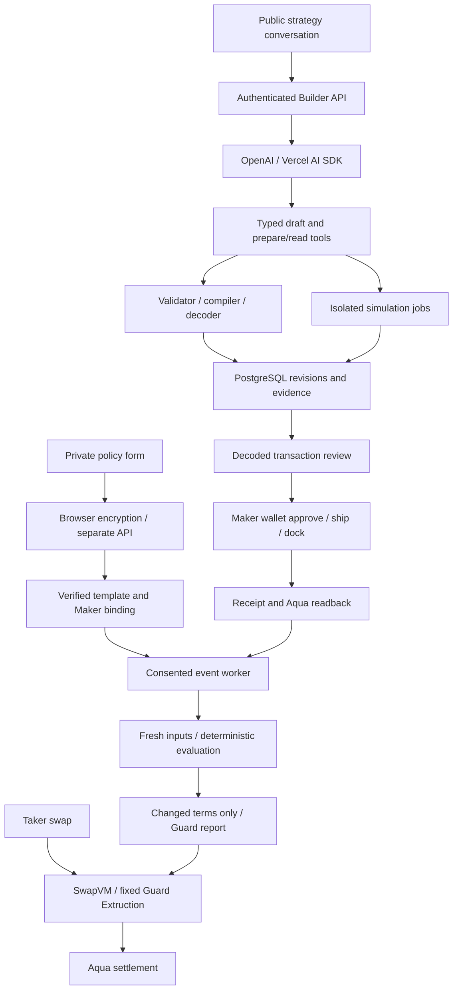

# Builder AI integration

The Builder uses one constrained design agent with the OpenAI provider and Vercel AI SDK. English is the product language, including the default agent response. Deterministic services own validation, compilation, permissions and execution evidence. The agent does not participate in runtime market-event evaluation.

This document describes architectural requirements, not a claim that every integration is deployed. Consult package manifests, implementation tests and deployment evidence for the running version. Event-driven evaluation supersedes the earlier report-renewal proposal; see [Event-driven authorization](SWAPVM-BUILDER-EVENT-TRIGGERS.md).

## Components

The Next.js frontend uses static export. Streaming goes through a separate authenticated service rather than Next server actions. Use an explicitly configured OpenAI provider and server-side model ID; do not accidentally route through a default model gateway. Keep Node compiler adapters and executor contexts out of browser imports.

Dependencies are pinned in the workspace manifests and lockfile. The original compatibility review considered `ai 7.0.99`, `@ai-sdk/openai 4.0.66`, and `@ai-sdk/react 4.0.102`; SDK 7 requires ESM and Node >=22. Builder services target Node 24. Verify React peer compatibility and the installed SDK declarations when upgrading. The relevant SDK 7 step limiter is `isStepCount`. CRE retains its separate Bun/WASM toolchain.

## Agent authority

The twelve application tools are `getCapabilities`, `resolveTokens`, `getWalletInventory`, `createOrPatchDraft`, `validateStrategy`, `compileStrategy`, `previewScenarios`, `simulateLifecycle`, `prepareRegistration`, `inspectStrategy`, `prepareCancellation`, and `exportStrategy`.

Provider tools edit public template parameters and can preview explicitly hypothetical allocations. They must not ask for a future Maker's wallet or treat a template as a registered order. Maker tools may additionally inspect owned inventory, compile instances, enqueue simulations and prepare wallet plans, subject to pinned template permissions.

Publication, wallet signing and automation consent are explicit authenticated UI actions, outside the model's tool set. Every tool rechecks ownership, expected revision, stage and deployment profile. A tool allowlist alone is not authorization.

Tool schemas express typed intent. Domain services independently enforce amounts, cross-field constraints, capabilities and permissions. Strict model schemas reject extra fields; nullable values or explicit operations represent optional intent. Do not assume model-side JSON validation enforces domain invariants.

Only allowlisted public results reach the model: status, revision, diff, missing fields, unsupported requirements, public summary, artifact/job IDs, source and observation time. Exclude policy plaintext, ciphertext, decrypted traces, authentication tokens, signatures and environment values before streaming or logging. Private policy editing and encryption use a separate browser form and API; the model receives at most the minimum completion status.

`store: false` is not a zero-retention guarantee or a TEE. Keeping private data out of model requests is the privacy boundary. Untrusted token metadata, external documents and tool text cannot change permissions or recipients.

## State and streaming

PostgreSQL is the source of truth for public conversations, immutable revisions, template versions, Maker instances, artifacts, simulations, plans, confirmations, bindings, subscriptions, evaluation jobs and deliveries. Use transactions, uniqueness constraints and worker leases rather than process-local maps.

A chat request contains the current user message, conversation ID, expected revision and idempotency key. The server loads trusted history after authentication and rejects client-supplied system messages, tool results or ownership claims. Validate stored UI messages against the current schema.

Concurrent edits to one revision return a conflict. Material changes invalidate old artifacts, simulations and unsent confirmations. Broadcast transactions remain tracked until reconciled. A model statement that an edit succeeded is not a committed domain change.

Long simulations run as persistent jobs. A job ID means queued, not passed. The UI reads progress independently; the model need not poll continuously. Aborting a chat stops its model request without erasing committed patches, queued jobs or broadcast transactions.

Reuse Privy authentication. Validate token issuer, app, expiry and user server-side, then verify Maker wallet ownership through trusted linked accounts or a challenge. Never trust `body.owner` or `body.maker`. API keys remain server-side.

## Provider and Maker flow

1. A Provider describes a public strategy, such as a zero-fee WETH/USDC range on Sepolia.
2. The agent checks capabilities and drafts parameters, showing known fields and revision differences.
3. A relative range uses a traceable price snapshot at Maker instantiation, producing concrete fixed bounds. It does not follow the market automatically.
4. The Provider configures private policy in the encrypted editor, reviews the immutable version and signs publication.
5. A Maker pins that version and supplies allocations and permitted limits. The validator rejects edits beyond the original template permissions.
6. Deterministic compilation and independent decoding verify the recipe, traits, Guard target and envelope. Preview and lifecycle simulation remain separate evidence levels.
7. The Maker reviews actual payloads, grants limited Aqua allowance and signs ship. Registration requires a successful receipt and state readback.
8. Explicit activation and automation consent enable event evaluation. Enabling B replaces A as the Maker's active Guard hash; drafting or GET requests do not switch it.

## Trusted onboarding and delivery

An authorization binding ties owner, Maker, signed template version, spec/manifest/recipe digests, program hash, order/strategy hash, chain, router, Guard, envelope commitments, consent scope and active generation. The server verifies signatures, recompiles and decodes; it does not accept an agent-provided hash as authority.

Each simulation job uses an isolated immutable approved configuration. Do not remove workflow binding checks to support new hashes. A production DON adapter must verify its own trusted provisioning source and revocation/version semantics.

Serialize report delivery per Maker, and separately coordinate Ethereum nonces when sharing a broadcaster. Persist request IDs, report identities, generations and pending transactions. A timeout after broadcast remains unresolved until receipt/readback reconciliation; do not blindly rebroadcast or switch hashes. Stopping or switching invalidates unsent work but cannot undo an already broadcast report.

Standing authorization does not expire because the worker is offline. Events cause fresh evaluation; only changed effective terms cause a report. Monitoring health, evaluation time and accepted onchain authorization must be shown separately.

## Acceptance

Verify real OpenAI multi-turn edits, missing or conflicting requirements, unsupported requests, malicious metadata, tool selection, error/429/abort recovery, ownership isolation and private-data exclusion. Offline fixtures are regression tests, not evidence of live model integration. The English migration changes future test inputs; it does not retroactively rerun recorded model evaluations.

Also verify PostgreSQL persistence, revision conflicts, immutable template permissions, wallet rejection/replacement handling, trusted new-hash onboarding, browser/API integration and event recovery. Fixed LP fees require guarded gross/net accounting and composition tests after the zero-fee lifecycle; unguarded fee tests do not establish support.

## References

- [OpenAI provider](https://ai-sdk.dev/providers/ai-sdk-providers/openai)
- [AI SDK agents](https://ai-sdk.dev/docs/agents/building-agents)
- [Tool calling](https://ai-sdk.dev/docs/ai-sdk-core/tools-and-tool-calling)
- [Message persistence](https://ai-sdk.dev/docs/ai-sdk-ui/chatbot-message-persistence)
- [OpenAI function calling](https://developers.openai.com/api/docs/guides/function-calling)
- [OpenAI data controls](https://developers.openai.com/api/docs/guides/your-data)
- [Privy access tokens](https://docs.privy.io/authentication/user-authentication/access-tokens)
