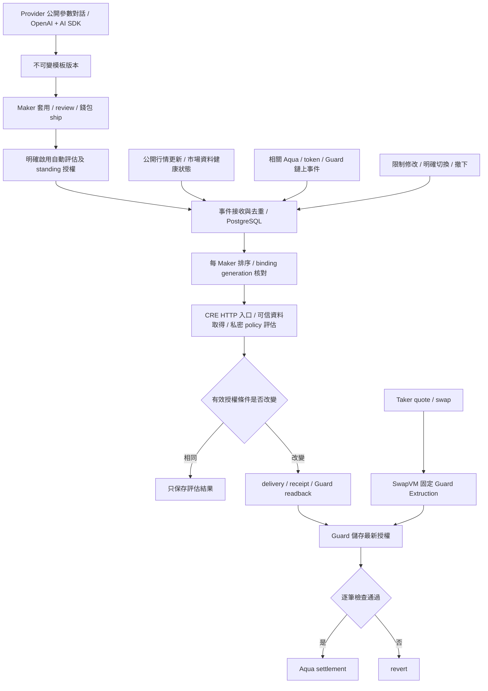

# Builder：事件觸發與 standing authorization

研究日期：2026-09-13（Asia/Taipei）。來源基準：`pintoolx/market-making` main `1d7f6a2257f27193d7faf070498cd3a54184ca0f`。
使用者指定：參考 PR #36，Builder 改採事件觸發，取代定期送 report。本文更新先前 Builder 文件的 TTL 續期設計；以下事件服務是實作提案，尚未建立。

原工作區正進行 ENS 修改，這次在 `/home/kuoba123/eth-glo/market-making-builder-review` 建立 main worktree 並完成 `git pull --ff-only origin main`。原分支與修改保留。

## 1. 實際合併了什麼

| 改動 | 已完成的行為 |
|---|---|
| [PR #32](https://github.com/pintoolx/market-making/pull/32) | Guard 接受 schema-2 standing report，`validUntil=0`；新增 Maker 的持續撤銷旗標；保留 schema-1 的 bounded TTL |
| [PR #33](https://github.com/pintoolx/market-making/pull/33) | 相同有效授權不再呼叫 `writeReport`；GET 不呼叫 evaluator/廣播；真正變更才發 report |
| [PR #34](https://github.com/pintoolx/market-making/pull/34) | Maker schema-3 明確選 `authorization: until-changed`，前端呈現無 report 到期時間 |
| [PR #35](https://github.com/pintoolx/market-making/pull/35) | 收錄 Sepolia standing report、unchanged、成功成交及拒絕成交證據 |
| [PR #36](https://github.com/pintoolx/market-making/pull/36) | 移除 Studio 的 report lifetime 輸入；舊 Provider schema 欄位保留供 bounded 路徑相容 |

因此 PR #36 本身是 UI 收尾，事件服務並未隨這個 PR 完成。Workflow 仍同時註冊 cron 與 HTTP handler；目前 create/re-evaluate action 可以叫用 HTTP simulation，但沒有涵蓋市場、Maker 狀態及 Provider 撤下的完整常駐監聽服務。前端的狀態刷新不是授權事件來源。

現有 delivery 比較 schema-2 的全部有效欄位，排除 `nonce` 和 `validAfter`，並核對 active hash。相同時保留原 report digest、nonce、接受交易；不同時才提交，必要時將 nonce 提升至鏈上保存值加一。這能處理順序執行的同秒請求，不能取代多 worker 的持久化序列控制。

## 2. 建議的完整流程

事件是「請重新檢查」的訊號，不是可信價格、已批准 report 或切換策略的權限。Workflow 仍從已驗證來源取得新鮮資料，讀取 pinned binding，私密政策只在既有 confidential evaluator 邊界內處理。現有部署是 simulation profile，這個流程圖不代表已取得硬體 TEE／正式 DON 證明。

每筆 quote/swap 仍同步呼叫 Extruction；它只讀最新已接受的授權。它不會啟動外部 CRE、等待 HTTP 回來再完成同一筆 swap。EVM log 來自已執行交易，不能回頭否決造成該 log 的成交；它適合觸發後續評估。無需因此新增自訂 SwapVM opcode。

## 3. 首版事件集合

以下名稱是待實作的 Pintool application events，不是 CRE 內建事件名稱或已存在的 API。

| 事件來源 | 處理方式 |
|---|---|
| Maker 首次啟用 | 驗證 registration、可信 binding 與 opt-in，評估並取得初次 standing report |
| Maker 修改限制或明確切換 | 新 revision/generation；驗證新承諾與授權，取消未廣播的舊工作；涉及 program 變更時先走重新編譯及錢包流程 |
| 公開行情更新 | 取得新的完整市場 snapshot，交 evaluator 判斷風控條件；先用既有 Kraken 資料語意，新增事件 adapter，不把任意 webhook 的價格當真 |
| Maker token/Aqua 狀態改變 | 按地址及策略過濾相關 logs，刷新 wallet、allowance、Aqua 狀態；會影響 policy 時排入評估。同筆多個 logs 合併 |
| Provider 撤下／已核准版本撤銷 | 建議對受影響且已啟用的 Maker bindings 排入 paused delivery，追蹤實際鏈上停用；不只從列表移除或停止後續工作 |
| Maker 鏈上撤銷或 dock | 停止該實例後續工作並更新狀態。不可因下一次行情事件而重新啟用 |
| 資料中斷／恢復 | 健康狀態轉換產生事件；在既有授權範圍內建議嘗試 paused report，恢復後以新鮮資料重評，是否恢復仍受 Maker 的撤銷與選擇約束 |

Provider 發布新版本只更新可選模板，不能自動改寫 Maker 已 pinned 的版本。撤下是否也停用現有實例，必須在 Maker 啟用條款及 Provider UI 明說；上表建議延續先前「撤下後停止舊授權運作」的產品目標，補足 standing 模式所需的鏈上動作。

初版建議統一由 Railway worker 接收事件，經 authenticated adapter 叫用現有 CRE HTTP handler。正式 deployed HTTP trigger 要使用 workflow 的 authorized key 簽署 gateway 請求；本地 CLI simulation 是另一個 adapter，不能把它稱為已部署的 DON event listener。[官方 HTTP trigger](https://docs.chain.link/cre/guides/workflow/using-triggers/http-trigger/overview-ts)

後續可將特定鏈上來源改成 CRE 原生 EVM log trigger，重用同一個評估核心；避免相同來源同時由兩條入口重複發布。Log identity/cursor 保存 chain、block hash、tx hash、log index，處理重連及 reorg；正式 trigger 的 confidence 按需求選定。[官方 EVM log trigger](https://docs.chain.link/cre/guides/workflow/using-triggers/evm-log-trigger-ts)

公開行情可從供應商 stream 或適當的資料取得 adapter 產生更新事件；目前 repo 只有 Kraken HTTP 取得，尚未驗證 stream adapter。不要先假設某個 websocket channel 能提供完整既有波動率計算需要的資料。若使用輪詢取得公開資料或低頻 reconciliation，那是資料取得／漏事件修復，不是定期刷新 Guard report。

## 4. 不可忽略的三個語意

### 授權不再因服務離線而自然過期

Schema-2 report 無 TTL；workflow、行情 watcher 或 Railway 中斷時，已保存授權仍可在 program deadline、envelope 和 report caps 內被使用。不能再聲稱「最多 10 分鐘就自動停單」。Heartbeat、斷線檢查仍有必要；但整個服務或鏈上 delivery 不可用時，不能保證成功發出 paused report。

UI 要分開顯示「鏈上授權有效」與「事件監控健康／最後成功評估」。單純關閉 worker 不等於鏈上停用。

Maker 可自行呼叫 `setStrategyRevoked(strategyHash, true)`；合約持續拒絕該 hash 的 enabled reports。這應提供直接錢包入口，不依賴 workflow 可用。解除撤銷不自動恢復 active，還要明確重新啟用並取得新 report。Dock、撤銷授權及 ERC20 allowance 撤銷是不同操作。

### 政策沒換檔，原子數量限制仍可能改變

`workflow/src/intersect.ts` 用最新 midPrice 把 Maker 的 token1 價值限制換成 token0 原子數量。例：以每 WETH 2,500 USDC 把 1,000 USDC 庫存上限換成 0.4 WETH；價格變成 3,000 時，相同 0.4 WETH 是 1,200 USDC。Guard 本身沒有在每筆成交讀 oracle 重新計算該價值。

因此「直到變更」是固定原子數量授權，不是永久的即時美元／百分比保證。既有 exact-term 比較可能因很小的價格變化而需要上鏈，即使 `allowedDirections` 一樣。第一版先保留正確的精確比較並記錄觸發頻率與成本；不要為省 gas 直接忽略會收緊上限的變化。

可合併同一批輸入的重複通知；若後續採價格帶或有界更新頻率，需另行設計保守上限、最大資料延遲與越界停用行為，取得清楚的產品語意並測試。行情突變到新 report 生效之間仍有延遲，不能說風險限制完全即時。

公開事件接收器只看公開資料；不要把 Provider 私密門檻搬到 Railway watcher 來判斷「是否越線」。私密條件由 confidential evaluator 判斷，AI 模型也不參與事件評估與 report delivery。

### 停用與切換須確認真正生效的 hash

Guard 每 Maker 只有一個 active hash。給 B enabled report 會切換 A；給尚未 active 的 B paused report 不會停用 A。要暫停目前策略，必須核對並作用於目前 active 的授權，不能把任一候選 paused 解讀為整個 Maker 已暫停。

切換、撤下及取消要讓舊工作失效，並處理已廣播但尚未確認的交易；DB generation 無法撤銷已在鏈上的舊 report。Maker 的持續撤銷旗標可阻止後續 enabled report，但 ordinary paused report 不提供相同的持續撤銷保證。

## 5. 對 Builder 與 PostgreSQL 的具體修改

- 保留 Provider 模板、Maker instance、私密表單與公開 AI 對話隔離、確定性 compiler/decoder、錢包確認；OpenAI + Vercel AI SDK 只服務建構流程。
- 把原 `RenewalConsent/renewal_jobs` 提案改成 `AutomationConsent/event_subscriptions/evaluation_jobs`；加入來源、去重鍵、binding revision/generation、資料時間與處理狀態。名稱是設計提案，不是已建 tables。
- 與應用狀態同一筆 DB transaction 保存 outbox；worker lease、retry、cursor/backfill、report deliveries 持久化。每 Maker 的切換及發送序列化；共用 EOA 廣播時另處理 Ethereum tx nonce。
- 分開保存 `lastEvaluatedAt`、`lastInputObservedAt`、`lastChangedAt`、`lastAcceptedReport`。成功 unchanged 不產生假交易，也不能拿很舊的接受時間當成本次評估失敗。
- Builder 新實例固定使用已驗證的 standing deployment profile；既有 bounded report 仍按照原 schema 解讀，不把零 expiry 任意套到舊 Guard。
- 新 Guard 地址嵌在 program Extruction args，換地址會改 program/order hash；舊模板／策略不能僅改 UI label 就當作遷移完成。
- 明確 action 控制 enable、switch、pause/revoke；GET 可重新查 readiness 並更新快取，但不呼叫 evaluator 或發 report。

目前 deployment bundle 的新 Guard：`0x64f6e18e85dae5ec2ee44fe7f9fc66cf2a1f056f`，revision `standing-v2`、Guard version 2、report schema 2、Maker input schema 3、program envelope version 2。這些版本名稱不可混成同一個版本號。Router 仍為 `0x47a875f39ba4b0d0beaa928bb071d4b4da0b4092`。[固定版本部署資料](https://github.com/pintoolx/market-making/blob/1d7f6a2257f27193d7faf070498cd3a54184ca0f/contracts/aqua-executor/deployments/11155111.json)

## 6. 建議 PR 順序與驗收

1. 更新 Builder schema/profile/consent 與 UI 語意，接新 Guard，補 Maker 直接撤銷入口；以最新 main 的 change-only delivery 為基礎。
2. Railway PostgreSQL migrations、outbox、subscriptions、per-Maker queue；先讓首次啟用、限制修改、明確切換和停止走完整事件流程。
3. 行情與相關鏈上事件 adapter，加入 stale/recovered、重連補資料、reorg、重複事件與 Provider 撤下的 fan-out。
4. 接回原 Builder 分批順序：V2 XYC recipe、對話/模板、CLMM/Pegged、simulation、wallet與可信新 hash onboarding。事件子系統與 Builder core 可以分批，但完整首版仍要自動運作。

必要驗收：相同條件反覆事件只評估不發 tx；條件收緊才發 tx；無事件不為延長期限發 report；超過一小時仍有授權但保留 caps/program deadline；瀏覽器關閉、worker 重啟、多 worker 不漏／重複切換；來源斷線與恢復；同 Maker A/B 舊結果不覆蓋新選擇；撤下、Maker revoke/unrevoke、dock、未知 receipt 與重連補事件。故障時如實展示 standing report 仍可能有效。

## 7. 本輪證據與限制

在 main worktree 重新執行，全部成功：

- Bun：`src/intersect.test.ts`、`guard-report/delivery.test.ts`、`market-maker-auth/workflow.test.ts`，45 passed / 0 failed。
- Node orchestrator：`cre-mandate-runner`、`cre-local-simulator`、`guard-observer`、`lp-readiness`、`service`，26 passed / 0 failed。
- Node + 本地 Anvil：`contracts/aqua-executor/test/concentrated.test.ts`，6 passed / 0 failed。包含 standing 時間推進、caps、持續撤銷、重新啟用及 active 切換。

測試使用既有本地依賴，未重新安裝或更改 lockfile；這是針對 main 的局部驗證，不是全 repo build/CI 或新事件服務的端到端驗收。紀錄見 [event-trigger-tests.log](strategy-builder-research/event-trigger-tests.log)。

PR #35 的 [已提交 Sepolia 證據](https://github.com/pintoolx/market-making/blob/1d7f6a2257f27193d7faf070498cd3a54184ca0f/workflow/verification/standing-authorizations/README.md) 顯示 standing 初次接受、unchanged 無新 tx、Tight 成交及 Defensive 拒絕；不是這次重新送出的交易，也不是切換 Defensive 成功或正式 DON/TEE 證明。

本次沒有修改應用程式、部署事件 worker、建立 DB tables、廣播鏈上交易、上傳 CRE、commit 或發 PR。原先 `10a494e` 研究的舊 Guard 地址與 600 秒續期假設保留為歷史，新的實作以本文及更新後 handoff 為準。
