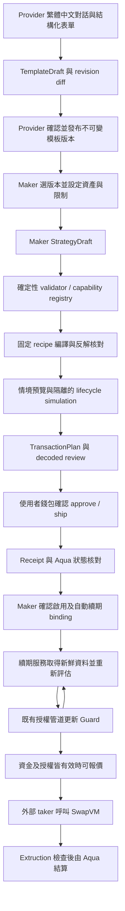

# SwapVM Strategy Builder：已確認範圍與整合研究

> **後續修正（2026-09-13，main `1d7f6a2`）**：本文件下文保存第一輪研究。使用者最新指定「事件觸發評估、條件改變才送 report」，取代其中固定 TTL 自動續期設計。新 Guard 為 `standing-v2`，舊 `0xfadc…1f70` 部署及「故障後 600 秒內自然失效」不再適用於新 Maker 路徑。GET 觸發 evaluator 的問題已在 main 修正。具體來源、已完成／待完成、風險語意、測試與實作順序請以 [事件觸發研究](SWAPVM-BUILDER-EVENT-TRIGGERS.md) 和 [最新 handoff](SWAPVM-STRATEGY-BUILDER-HANDOFF.md) 為準；Provider 模板、零費率、Guard Extruction 與首版自動運作的選擇保留。

研究日期：2026-09-13（Asia/Taipei）。基準：`main` / `10a494e`。
本文件記錄研究結果與建議，**不是 Builder 已完成的交付聲明**。
原始需求為使用者提供的十二節 MVP 規格；本輪要求先研究並討論前後端整合。
使用者已表示沒有其他待確認事項。接手實作先讀 [交接清單](SWAPVM-STRATEGY-BUILDER-HANDOFF.md) 與 [原始規格](strategy-builder-research/original-spec.txt)；原規格的 Extruction／keeper 排除條款，以本文件記錄的後續選擇為準。

## 已確認的方向

使用者已決定：**Builder 也要接 Pintool Guard，調整原規格禁止 Extruction 的條款。**

後續三項產品選擇亦已確認：

- 首版主要流程為 **Provider 發布模板，讓 Maker 套用**。
- **先完成零費率流程，再增加通過驗證的固定 LP 費率**；非零費率不得假裝已支援。
- **首版必須有自動授權續期**。Maker 明確啟用後，服務持續重新評估並更新 report；手動更新不能代替此項驗收。

後續討論補充確認（2026-09-13）：**Provider 私密風控門檻只透過瀏覽器加密表單輸入；AI 對話只處理公開策略參數。** 私密欄位不可加入模型請求、對話歷史或工具回傳給模型的內容；畫面應在輸入前清楚提示不要把私密門檻寫入聊天。瀏覽器加密不改變目前 simulation profile 尚未證明 TEE 保密性的限制。

建議替換條文：

> 允許 recipe 內固定指向已驗證 Pintool Guard 的 Extruction，作為結算前的唯讀授權檢查。目標地址、Guard 版本、envelope 與合法指令位置由 deployment profile 和 compiler 決定。禁止使用者或 LLM 指定任意 external target、改寫交易 registers、移除／繞過 Guard，或新增 hooks、自訂 router、opcode、AquaApp。

其他排除項維持原意，包括自動 rebalance/recenter、DCA、跨協議操作、後端保管使用者資產私鑰、LLM 自由產生 calldata，以及未經使用者確認的簽署／廣播。針對原規格「禁止 keeper」的條款，使用者已核准的例外只限 **Guard report 自動續期服務**；Maker 明確啟用時授權此持續行為，服務不取得 Maker 資產簽署權限。

Guard 的 report delivery 有自己的授權來源，與 Maker 資產簽署分開。沿用測試部署不代表已取得 production DON/TEE 驗證；也不授權部署新合約或上傳 CRE workflow。

## Repository 盤點

沒有找到適用的 `AGENTS.md`。已讀 workspace/package scripts、lockfile、公開 `.env.example`；沒有讀取真實 `.env` 或錢包私鑰。

| 部分 | 目前實作 | 對 Builder 的意義 |
|---|---|---|
| 前端 | Next.js / React，Cloudflare Pages 靜態匯出 | 新增 Builder 畫面，API 放既有 orchestrator；不能直接假設能新增 Next server actions |
| Ethereum 帳戶 | Privy，`useAccount` 提供登入與發布用 `personal_sign` | 可以重用帳戶來源；資產交易的 wallet review、switch chain、送出與 receipt 狀態仍要新增 |
| 舊 ChatPanel | Solana 元件，`setTimeout` 後呼叫建立範例節點 | 不是可用的 SwapVM 對話代理；不沿用其假對話／Solana 交易邏輯 |
| LP 發布 | CLMM 零費率、版本與密文綁定、撤下 | 可參考版本及簽名驗證；Provider template 與 Maker 可執行草稿需要不同資料模型 |
| 執行核心 | XYC / concentrated / pegged 編譯、Aqua ABI、quote/swap/ship/dock | 重用純編譯、數值與交易建構；不要把可簽名的 executor `Ctx` 暴露給 agent |
| Guard | V1、V2 與 Extruction；V2 讀實際 Aqua 庫存、每 Maker 一個 active hash | 新 Builder 必須完整綁定 Guard，不只顯示一個保護標籤 |
| 授權服務 | 靜態 catalog、Provider bindings、CRE runner、鏈上 receipt/readback | 新 hash 仍需手動 provisioning；這是端到端 Builder 的關鍵缺口 |
| readiness | 同區塊查 Guard、Aqua、wallet balance、allowance，結果會過期 | 可重用，但不能取代完整 settlement simulation 或分發狀態 |

版本依據：`pnpm@10.6.2`；executor 要求 Node >=24，本機 `v24.14.0`；`@1inch/swap-vm-sdk` 固定 `0.4.4`，executor/frontend 的 viem 為 `2.56.3`，orchestrator 的 viem 為 `2.34.0`。實作前應明確處理跨 package 型別／版本差異，不盲升 latest。

目前沒有安裝 `@1inch/aqua-sdk`，Aqua 透過 repo ABI 與 viem 存取。Manifest 應如實記錄 `aquaSdk: null` 與 ABI adapter 版本；若決定引入 SDK，再核對並固定版本，不能填一個沒有使用的版本。

來源：[`compile.ts`](../contracts/aqua-executor/src/compile.ts)、[`curves.ts`](../contracts/aqua-executor/src/curves.ts)、[`concentrated.ts`](../contracts/aqua-executor/src/concentrated.ts)、[`guard.ts`](../contracts/aqua-executor/src/guard.ts)、[`useAccount.ts`](../frontend/src/app/providers/useAccount.ts)、[`ChatPanel.tsx`](../frontend/src/app/components/Creator/ChatPanel.tsx)、[`server.mjs`](../orchestrator/src/server.mjs)、[`LP-RELEASES.md`](LP-RELEASES.md)。

## 部署與能力證據

本輪在 Ethereum Sepolia finalized block **11690067**，hash `0x4f0b635cca08fd98a4528ca1debce1101a77ca56568831a61d5de1955c63b843`，重新做唯讀檢查。

| 合約 | 地址 | Runtime bytes |
|---|---|---:|
| 既有 Router | `0x47a875f39ba4b0d0beaa928bb071d4b4da0b4092` | 20541 |
| Aqua | `0x1111113ccf1426a8e30e2bff5e005d929bf6a90a` | 5619 |
| Guard V2 | `0xfadc3165abeb127a0815d5ea4e2862ed430e1f70` | 5963 |
| 官方文件 canonical Router 地址 | `0x111111338c5091e8440b67b168bae16a668ac0de` | 0 |

確認 Router.AQUA、Guard.router、Guard.aqua 彼此符合 deployment bundle，Guard `simulationMode=true`。WETH decimals=18、USDC decimals=6。完整 readback、code hashes 和限制見 [`deployment-read.json`](strategy-builder-research/deployment-read.json)。這是本輪的 code presence / binding 證據，**不是新完成的 source-to-runtime 重建或所有 recipes 的部署相容性認證**。

現有建置腳本固定 SwapVM v1.0.2 / `32c687c2b73101fc26549e48fa1ff8a4d73afbac`，Aqua / `9c5c42e5840e8741fba3597c48456c9510212b66`。應把零散 deployment、ABI、source manifest 與測試證據整理成 Builder 的版本化 profile，加入 Guard/forwarder 身分、code hashes、驗證區塊、opcode table hash、分發狀態與失效規則。

不要從 upstream main 推導此部署的 opcode。這個 Aqua table 的 XYC=17、concentrate=18、decay=19、salt=20、flat-input-fee=21、pegged=31、Extruction=32；有 reserved no-op gaps，所以未知／保留指令不能只靠鏈上 revert 來拒絕。

| 能力 | 目前證據 | Builder 尚需完成 |
|---|---|---|
| XYC | 純編譯 golden bytes；本地 Guard V1 執行；既有 Sepolia 一般 LP 紀錄 | 新 Builder 的 Guard V2 recipe 相容性與完整流程；目前 V2 compiler wrapper 僅接受 concentrated |
| 固定區間 CLMM | bigint、6/18 decimals、地址反轉；本地 V2；既有 Sepolia 成交與拒絕 | 對話 snapshot、diff、review、非 50/50 庫存可用性預覽 |
| Pegged | SDK/原始碼核對；本地 6/18 decimals、雙向、V1 Guard 與一般含費 recipe | 新 V2 recipe；使用者輸入的 reference/rate 語意；目標 token pair 與資料來源驗證 |
| 固定 LP input fee | 一般未接 Guard 的 compiler/本地測試支援 | **目前 guarded recipes 禁止非零費率**；需獨立 gross/net 記帳設計與測試，不能直接打開 |
| Deadline | 固定 uint40 deadline 已使用 | 「無期限」需要明確新 recipe；不能把 0 當無期限，該 opcode 在 timestamp >0 時會拒絕 |
| 方向／單筆／庫存上限 | Guard report＋Maker envelope 交集 | 分類與 UI 說明；每筆額度不等於每日累計；庫存上限不等於庫存底線 |
| Exact-output | 現有 Guard 明確拒絕；V1 有拒絕測試 | Builder/V2 補拒絕測試並顯示 unsupported；不能宣稱成功支援 |
| Decay / 原生 access gates | pinned source 有對應指令 | 未證明與現有 Guard 的組合安全或與分發通路相容；先不 product-enable |
| Routing / discovery | 有自家直接 taker 測試 | 沒有證據證明新 Builder 策略會被聚合器收錄；獨立顯示未接入／未驗證 |

Capability registry 的六個欄位 `sourceImplemented / sdkEncodable / runtimeVerified / compositionTested / productEnabled / routingCompatible` 應附 profile、recipe、測試模式及 evidence refs。`runtimeVerified` 不能以 mock-token 本地測試偷換成某個 Sepolia recipe 已驗證；建議各欄位容納 unknown/blocked 狀態與原因。

## Guard 整合後需要補進原規格的內容

1. **新增授權資料模型。** 除原本五個 model 外，加入 `AuthorizationBinding`：owner/Maker、draft revision、compiled digest、strategy hash、Guard identity、policy commitment、envelope caps、TTL、issuer profile。使用者的靜態 Maker 上限應綁入 program，工作流只能在其內縮限。
2. **拆開三種期限。** 草稿／confirmation 有效期、策略 program deadline、Guard report TTL 是三件事。策略可活一天，不代表一次 report 能活一天；目前 report 最長 600 秒。
3. **把 report 更新納入首版必要範圍。** 使用者已選擇自動續期。Maker 明確啟用後，由常駐服務在到期前重新評估 policy 和新鮮市場資料、提交新 report，並確認 receipt/readback。重新傳送相同 report 不會延長有效期。這不包含 rebalance、換幣或 keeper 資產簽署；必須另外保存與驗證 Maker 的續期授權。
4. **切換是實際副作用。** 對策略 B 接受 enabled report 會使同一 Maker 的 A 失效。建立草稿、模擬、查看狀態都不能隱式切換 active 策略。UI 要展示目前 active 與將被替換的策略，最後才讓使用者確認啟用。
5. **讀取 API 不應發 report。** 現有 `service.get()` 會呼叫 runner；Builder 應把純 GET 狀態與 POST 授權動作拆開。按頁面刷新不應成為鏈上寫入授權。
6. **新增 hash 的可信 onboarding。** 不能把 agent 輸出的 hash 加進 catalog 就授權。後端應驗證 owner、revision、確定性編譯結果、完整 bytecode/traits/envelope、policy binding，再向既有發送端提供已核准的資料。工作流端仍須驗證來源及對應 policy，不信任任意 HTTP payload。
7. **Report nonce 與發送序列。** 目前 nonce 以 `(maker,strategyHash)` 檢查，active 是 Maker 層級。新增每 Maker 的 report 發送序列與 pending receipt reconciliation，防止不同草稿的延遲結果互相切換；不要只用模型輸出的 nonce。
8. **簽名後的事實不能由 revision 撤回。** 修改草稿會使尚未送出的舊確認失效，但已廣播／已成交的鏈上操作仍要查 receipt，必要時準備新 pause/dock，不顯示為自動回滾。

## 建議前後端分工

首版使用路徑已確定為 **Provider 對話建立／發布模板 → Maker 套用 → 各自錢包確認註冊與啟用**。前一版研究建議的 Maker 自建優先路徑已被此選擇取代。

新增獨立 `StrategyTemplate` / `TemplateVersion` 與 `MakerStrategyInstance`：模板保存 Provider、模型、允許參數及 policy commitment；Maker 實例綁定不可變模板版本、自己的 wallet、allocation、限制、compiled hash 與續期授權。Provider 發布不能替 Maker 核准資產操作；模板本身不冒充已完整綁定 Maker 的 `ValidatedStrategy`。每位 Maker 套用後分別編譯與取得 Guard report。Provider 新版本不會自動改寫既有 Maker 實例。



此圖為建議產品流程，不宣稱這些新環節已實作。Ship 與 report 是不同狀態；應先確認授權管道可用，避免使用者完成 ship 才發現無法取得 report。沒有 report 時保持「已註冊／等待授權」。

前端建議新增 Provider Builder、模板市場／版本詳情，以及 Maker「我的策略」頁，沿用既有樣式、導航及 Privy：

- 左側多輪對話，右側策略摘要、缺少欄位、不支援需求與實際強制範圍；LLM 只提 patch。
- 使用者說「現在上下 5%」時，顯示具來源／時間的中心價與具體固定邊界，另外確認數值；修改實質參數就新 revision。
- 審閱卡從實際 decoded payload 產生，分開顯示 token 地址／decimals、數量、spender、有限 allowance、Guard 上限與受影響的既有策略。
- 分開顯示 draft/validation、simulation confidence、registration、authorization、funding/fillability、routing。取消走 dock；allowance 撤銷是另一步。
- Maker 頁另顯示自動續期是否啟用、最後一次成功評估／report、授權到期時間、下次預定評估及失敗原因。「停止續期」和「鏈上取消」是不同操作；停止續期後既有 report 仍可能有效至其到期。

後端沿用 orchestrator 的服務邊界；建議抽 `packages/strategy-builder` 共用純 schema/validator/compiler，隔離 RPC、fork worker、conversation adapter 和 wallet transaction preparation。這是建議位置，未建立 package。

- 保留原始五種資料型別；加 owner 隔離、revision compare-and-swap、manifest/recipe versions、confirmation digest 與狀態轉移。
- `programHash = keccak256(program bytes)`；此 Aqua profile 的 `orderHash = router.hash(order) = keccak256(abi.encode(order)) = strategyHash`。欄位分開命名但記錄正確的相等關係；應用 JSON hash 另存 `specHash`。
- 原規格十二個工具全部維持 prepare/read 能力：`getCapabilities`、`resolveTokens`、`getWalletInventory`、`createOrPatchDraft`、`validateStrategy`、`compileStrategy`、`previewScenarios`、`simulateLifecycle`、`prepareRegistration`、`inspectStrategy`、`prepareCancellation`、`exportStrategy`。新增 Guard 授權工具也只能準備可審閱請求，不能給模型任意 report broadcast 能力。
- 每個工具回傳 schema/version/source/context/errors，token metadata 與模型文字均當資料處理。對話送去一般 LLM 不等於進 TEE；已確認只送公開策略參數，Provider 私密門檻由瀏覽器表單及既有加密流程輸入，不送模型。
- Privy 前端登入與 CORS 不等於 API 已驗證 owner。現有 demo 的 Maker catalog／mandate API 不能直接當多使用者權限層；新增服務端 session 驗證、錢包所有權綁定、草稿／confirmation 授權及資源限額。
- 隔離 fork worker，只能對 fork 寫入，對 public RPC 唯讀；不能把 repo 的既有 Maker/Taker 簽署流程直接掛給 agent。

## 自動續期的首版驗收

自動續期必須是後端常駐服務，不依賴 Maker 持續開啟網頁或 GET 輪詢。只對明確 opt-in、未撤銷的 Maker 實例工作：

- 依原先核准的不可變模板版本、Maker 上限與當前 policy 評估新資料；不自行換版本、換 hash 或放寬 Maker envelope。
- 每次送出前重新確認 Maker 的 active 選擇、續期授權、Provider 撤下狀態、program deadline 與策略是否已 dock。切換／停止後的舊排程不能重新啟用舊策略。
- nonce、排程與已廣播交易要持久化；每 Maker 序列化 delivery，處理服務重啟、多 worker、timeout 與交易已送出但 receipt 未回的情況。未知結果先 reconcile，不能直接造新 nonce 重送。
- 新鮮資料失敗時不重播舊決策延長授權。已知 policy 拒絕時可依明確核准的策略提交 paused report；來源不可用時停止續期，既有 report 最遲在原 TTL 到期後失效。
- 提前排程、保留重試空間，且只有 receipt 與 Guard readback 成功才顯示續期成功。無法保證 RPC／CRE／區塊鏈故障期間仍可成交。
- Maker 停止續期後不再發新 report；已送出的交易仍須追蹤。若使用者要立即取消，準備獨立錢包 dock 流程。UI 不把停用服務誤報為鏈上已取消。
- 測試必須涵蓋跨越多個 TTL 的連續自動更新、瀏覽器關閉、資料過期、policy 拒絕、重啟恢復、併發、active 切換、模板撤下、取消及拒絕晚到結果；只做單次手動 report 不算完成。

目前部署為 CRE simulation profile。可先在隔離測試及明確標示的 testnet simulation 環境完成續期服務；production DON/TEE 存取與 deployment 授權仍須另行處理。自動續期服務不會使 simulation report 變成正式 DON/TEE attestation。

## 模擬與資金語意

原規格的三層展示與五種 evidence mode 保留：數學 preview、固定 context quote、完整 lifecycle；`mock / local-upstream / fork-with-overrides / fork-real-context / live-read`。

Guarded lifecycle 還需要「有效授權／過期／缺失／方向禁止／舊 active hash／超出 caps」案例。未 ship 的草稿，應在 fork/local-upstream 建立 allowance、ship 與明確標示的 report fixture，再測 quote/swap/dock。若模擬改了 Guard storage 或冒用測試 forwarder，也必須記錄為 override，不得宣稱是真實 CRE delivery。

完整測試要驗雙方向、same-context quote/swap、低庫存、區間邊界、deadline/report TTL 邊界、連續成交、allowance 不足、receipt 失敗、dock 後失效、每 Maker active 切換；exact-out 在目前 profile 應驗明確拒絕。

Maker approve 的 spender 為 Aqua；現有 EOA taker path approve Router。Ship 是登錄 virtual balance，資金仍在 Maker 錢包。分別呈現 wallet balance、allowance、各策略帳本和已知 commitments，不能相加成實際資本，也不能宣稱 Guard 是跨策略全域資金預留或保證最大損失。

## 建議交付次序與驗收對照

| 原規格階段 | 整合後完整工作 | 本輪狀態 |
|---|---|---|
| Phase 0 | 版本化 deployment/Guard profiles、六層能力矩陣、schema、來源、unsupported 分類 | 已研究及補本輪 RPC 證據；可執行 registry/schema 尚未建立 |
| Phase 1 | XYC guarded vertical slice：Provider 對話與模板版本、Maker 套用、revision、validator、確定性編譯、decoder、完整模擬、export/plan | 純底層可重用；新 Builder 未實作，V2/XYC recipe 驗證列第一個 gate |
| Phase 2 | 固定區間 CLMM、核對過的 Pegged；deadline、固定 LP fee 與其他 modifier 各自過組合 gate | CLMM 優先接入；費率、Decay、access 未驗證的組合仍列待完成，不用一般 LP 冒充 |
| Phase 3 | 錢包 review、owner 隔離、ship/dock、receipt/state、可信新 hash onboarding、Guard 自動續期及狀態展示 | 有部分後端／前端基礎，端到端新流程與常駐續期服務仍待實作；自動續期為首版必要驗收 |
| Release | 啟動／環境範本、鎖定版本、自動化與 browser 測試、支援／拒絕示範、來源與授權核對 | 尚未有 Builder release；真實交易入口預設關閉 |

原驗收清單全部保留：6/18 decimals 與 token 反轉、snapshot 固定區間、unsupported rebalance/DCA、unknown opcode/traits/hooks、deployment/SDK mismatch、quote 成功但 allowance 不足、shared inventory、不足 RPC/access、拒簽／失敗／取消、惡意 metadata、bytes 可重現、跨 owner 隔離。另增加固定 Guard target、不可繞過 gate、舊 report/confirmation 失效與 active 切換驗收。

若 guarded 固定費率需要改合約，先把原因與候選方案提出討論；原規格未授權部署新 production 合約。不能把「非零費率目前關閉」宣稱成這部分已完成。

## 本輪已執行的檢查

```sh
# contracts/aqua-executor；所有寫入只在各測試的本地 Anvil
ANVIL=/path/to/anvil node --test \
  test/compile.test.ts test/concentrated.test.ts \
  test/pegged.test.ts test/guard.test.ts
```

**22 tests passed，0 failed，0 skipped**。見 [`tests.log`](strategy-builder-research/tests.log)。這些是現有實作的測試，包含本地上游合約、mock ERC20 與合成 report；不代表 Builder 的新流程已通過，也沒有重跑公開鏈資產交易。本輪未跑新的 fork lifecycle 或 Builder browser 測試，因為新產品尚未實作。

## 官方來源與適用邊界

- [Verified contract addresses](https://business.1inch.com/portal/documentation/aqua/reference/verified-contract-addresses)：作為查閱入口；此處 Sepolia 結論以本輪固定區塊 readback 為準。
- [Pinned AquaOpcodes](https://github.com/1inch/swap-vm/blob/32c687c2b73101fc26549e48fa1ff8a4d73afbac/src/opcodes/AquaOpcodes.sol)：此部署相容性研究的指令來源，不能換用 main。
- [Pinned Fee](https://github.com/1inch/swap-vm/blob/32c687c2b73101fc26549e48fa1ff8a4d73afbac/src/instructions/Fee.sol)：input fee 會在內層執行時改寫 amountIn，解釋為何現有 Guard 不能直接接非零 fee。
- [Pinned Controls](https://github.com/1inch/swap-vm/blob/32c687c2b73101fc26549e48fa1ff8a4d73afbac/src/instructions/Controls.sol)：deadline 與 taker/tx.origin 存取條件須各自核對，非每個 Aqua recipe 都自帶同一 gate。
- [SDK README](https://raw.githubusercontent.com/1inch/sdks/master/typescript/swap-vm/README.md)：僅查閱概念；本地鎖定 0.4.4 套件與 deployed profile 決定實際 API/bytes。
- [Build an AquaApp](https://business.1inch.com/portal/documentation/aqua/getting-started/build-an-aquaapp)：理解 Aqua 整合；本功能沿用既有 SwapVM router，不建立 Custom AquaApp。
- [Pinned SwapVM license](https://github.com/1inch/swap-vm/blob/32c687c2b73101fc26549e48fa1ff8a4d73afbac/LICENSES/SwapVM-1.1.txt)：非一般 MIT。Release 前核對 Aqua、SwapVM 及實際使用 SDK 的條款與適用性；本研究不作商用授權結論。

Powered by SwapVM — © Degensoft Ltd 2025.
