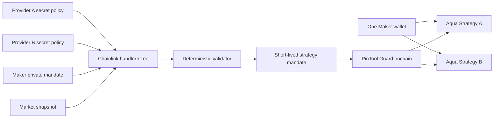

# ETHOnline 題目盡職調查：PinTool Confidential Strategy Mandate

日期：2026-09-12

這份文件回答一個問題：目前的「Provider 私密策略 + Maker 私密限制 + Chainlink TEE + Aqua 執行」是否足以成為有競爭力的 ETHOnline 作品？結論不是無條件肯定，而是**有條件地繼續**。

最值得做的題目不是一般的動態做市器，也不是單一 Toxic-Flow Shield，而是：

> **PinTool Confidential Strategy Mandate**  
> A Maker lets a proprietary strategy use the same self-custodial balance only within private, enforceable limits.

對外仍可使用產品名稱 **PinTool: Confidential Market Making**。`Confidential Strategy Mandate` 是本次真正要讓評審記住的機制：Provider 不交出 alpha，Maker 不交出完整風險政策；TEE 只產生短效、受限的執行授權，SwapVM 在每筆成交時強制執行。

## 最終判斷

| 評估面向 | 判斷 | 原因 |
|---|---|---|
| Chainlink Confidential Workflow | **強** | 兩個互不信任的角色都有不該公開的輸入；拿掉 TEE，產品的核心合作模式就不成立。 |
| 1inch Aqua Continuity | **中高，但必須補強** | 同一 Maker wallet 可支援多個策略，而且不用搬資產；但「策略 routing」本身已有非常接近的作品。必須讓 mandate 成為可逐筆執行的 SwapVM primitive。 |
| 原創性 | **中高** | 「私密雙方合成 + 自託管授權」的組合有辨識度；單獨看私密策略、共享流動性或 AI routing 都已有前例。 |
| 週末可完成性 | **中** | 兩套固定策略、一次 regime switch、一個 Guard 足夠。若做任意 Provider marketplace、績效排名、動態資金分配，完成率會急跌。 |
| 得獎機率 | **值得押，但不能保證** | Chainlink 的題目契合度高；1inch 是否得名次，主要取決於真實 SwapVM token transfer、Guard enforcement，以及是否講出 Aqua 不可替代的原因。 |

我的誠實評分：若只有漂亮 UI、TEE terminal output 與一筆獨立 Aqua swap，約 **4/10**；若完成本文的六個證據，約 **7/10**；若再證明動態多方秘密輸入與 sequence-bound quote safety，才回到 **7.5/10**。它有得獎相，不是穩贏題。

## 第一輪：官方獎項到底獎勵什麼

ETHOnline 的 1inch 題目要求 custom Aqua app、官方 Aqua／SwapVM、真實鏈上 token transfer，並明說使用 SwapVM 會得到更高評分；本地 fork 合格。Continuity pool 第一名為 $1,500、第二名 $500。[^ethonline-1inch]

這代表評審要看的不是「我們有呼叫 Aqua」，而是：

1. Aqua 的 shared-liquidity model 讓什麼新部位成為可能；
2. SwapVM 如何在成交路徑中執行你們的規則；
3. 最後真的有 ERC-20 movement 或可驗證的 revert。

Chainlink 的 Best Confidential Workflow 要求真實使用 `handlerInTee`，在 enclave 裡處理至少一項敏感輸入，而且 confidential portion 必須是核心功能。CRE CLI simulation 或 live deployment 任一都合格。[^ethonline-chainlink]

因此隊友目前跑通 local simulation 已經跨過最低資格線；正式部署是加分，不是 demo 成立的前提。真正的缺口是讓 workflow 的結果更新 Guard state，並由那個 state 決定 Aqua swap 成功或失敗。

## 第二輪：1inch 得獎作品呈現的模式

### 高名次作品創造一種具體的新部位

**Aqua Outcome Market** 得過 1inch 第一名。它不是一般 AMM UI，而是把 prediction-market 專用的 pm-AMM invariant、跨多個 outcome market 的共用資金與 JIT borrowing 合在一起。拿掉 Aqua 後，同一資本同時支援多市場的主張會消失。[^aom]

**Lotus** 得過 1inch 第二名。核心是一條很容易驗證的 monotonic invariant：大戶只會沿價格階梯賣出，成交後永遠不買回。它另外實作 custom SwapVM opcodes、兩個 venue 共用同一核心，以及閒置資產 JIT 生息。[^lotus]

**TenorFi** 得過 1inch 第三名。它將 Aqua position 變成 fixed-for-floating funding-rate derivative，並新增週期結算 opcode；Chainlink CRE 提供原本不存在的 funding index。[^tenorfi]

這些作品的共同點不是頁面多，而是可以用一句規則測試其金融行為。

### 一般動態做市已有很多，而且排名通常較弱

**ProaqctiveMM** 已做過 oracle-driven dynamic AMM，最後是 1inch 第四名。[^proaqctive]

**Aqua Prime** 更接近我們原本的 Strategy Router：它讓多個 candidate SwapVM programs 在同一本 inventory 上競爭，用 maker score 選路，並由 AI 調整 desk knobs。它還實作 custom `SkewPricer` opcode、`PrimeSelector`、約 60 個 Foundry tests。公開頁面沒有顯示 1inch 得獎。[^aqua-prime]

**Doca Finance** 已處理 Aqua shared balance 的 inventory risk：當一個錢包承諾給多個策略時，directional flow 可能讓實際錢包餘額不足，造成仍在報價的策略成交 revert。Doca 以 dynamic fee 和 keeper dock／re-ship 修復，並提供對照數據。公開頁面也沒有顯示 1inch 得獎。[^doca]

所以以下敘事已不夠新：

- AI 根據市場切換 aggressive／defensive strategy；
- oracle 改 spread 或 inventory skew；
- 多個策略共享同一份 liquidity；
- 一般的 toxic-flow／depeg protection。

它們可以作為 demo 內容，不能作為唯一創新。

### 私密策略生成與私密共享資金也已有前例

**Sluice** 已讓使用者以自然語言建立 Aqua strategy，將推論放在 0G TEE 裡，再由 deterministic validator 與 compiler 產生 SwapVM bytecode；它甚至已在 pinned Base fork 上完成真實 ship 與 fill。[^sluice]

**Cleverly Using Money** 得過 1inch 第二名，將匿名資金池接到 Aqua，使私密資本可跨多個策略重用。[^cleverly]

**Private Deals** 也探索 Aztec private accounts + Aqua；它最有價值的部分是誠實記錄了失敗：多位成員共享流動性時，無法同時允許超額 provision 又阻止某位成員 over-spend。[^private-deals]

因此 PinTool 的差異不能只說「privacy + Aqua」或「TEE 生成策略」。差異必須是：

> **兩個不同利益方在不交換秘密的情況下，產生可撤銷、短效、逐筆 enforce 的資金使用 mandate。**

## 第三輪：Chainlink 過往得獎作品教了什麼

**Lineage** 得過 Chainlink Confidential AI Attester。它刻意只生成一個 dossier chapter，接著用獨立 deterministic verifier 逐項核對 citation，最後才把 evidence bundle digest 錨定上鏈。它的優勢是範圍窄、驗證器獨立、輸出可追溯。[^lineage]

**goHealthMe** 也得過同一 Chainlink 類別。原始健康資料留在 TEE，只將 `verified / confidence / digest` 寫鏈上，而合約真的用 verdict 決定是否付款。[^gohealthme]

這些作品反覆使用同一個結構：

```text
private input
  → confidential computation
  → minimal structured verdict
  → deterministic/onchain gate
  → irreversible state or money movement
```

PinTool 不應讓 LLM 直接輸出任意 token amount。模型可以把 Provider 的規則轉成候選結構；確定性 validator 應取 Maker hard caps、expiry、token pair 與可用餘額的交集，最後只輸出：

```text
activeStrategyHash
maxAmountIn
maxInventoryAfter
expiresAt
sequence
providerCommitment
makerPolicyCommitment
decisionDigest
```

## 第四輪：底層能力與不能亂講的地方

### Aqua 的 shared balance 是承諾，不是保留

Aqua 的 virtual balance 是每個 strategy 的 accounting ceiling；token 仍在 Maker wallet，`pull()` 時才真正移動。官方說明明確指出，同一個真實餘額可以支援多個 strategy，但若多個 virtual commitments 超過錢包實際 balance／allowance，就會變成 first-fill-wins，後到的交易可能 revert。[^aqua-overview][^aqua-access]

因此 demo 可以說：

> 同一個 Maker balance 支援 Strategy A 與 B，不需要移動資產。

不能說：

> Aqua 已替兩個策略安全保留各自額度，或兩邊一定能同時成交。

MVP 最安全的設計是兩套策略都已 ship，但 Guard 每次只允許其中一套成交。這同時表現 shared liquidity 與消除 double-commitment race。

### Aqua strategy 本身是公開且 immutable 的

Strategy 參數由 hash 識別，上架後不能修改；改參數要 `dock()` 舊策略再 `ship()` 新策略。[^aqua-repo]

因此「Provider 的整個 executable strategy 永久保密」是不實主張。公開鏈上仍看得到 program bytes／strategy hash。真正能保密的是：

- Provider 如何判斷何時啟用哪個 public execution envelope；
- Provider 的 signals、thresholds、feature weights；
- Maker 原始 drawdown／inventory／fee preferences；
- 執行前的下一步選擇。

### Chainlink TEE workflow binary 也不是秘密

官方 Confidential Workflow template 說 workflow binary 本身不保密；TEE 保護的是 workflow 計算的資料。Secrets 由 Vault DON 直接釋放到 attested enclave。[^cre-templates]

官方 Portfolio Rebalancing starter 把 target allocation、drift threshold、trade cap、reserve floor 等放在 workflow secrets，並由 `runtime.getSecrets()` 於 `handlerInTee` 讀取。[^cre-rebalancing]

這暴露目前最大的工程風險：官方範例證明的是 **workflow owner 預先配置秘密**，沒有直接證明網站上的任意 Provider 與 Maker 能各自即時建立一份只對 enclave 可讀的秘密。

在隊友確認動態加密輸入管道前，pitch 必須區分兩個版本：

- **已證明版本**：Provider policy 與 Maker mandate 預先配置為 Vault DON secrets，TEE 合成後回傳最小結果。
- **產品目標版本**：網站使用者各自加密並提交 policy，只有 attested enclave 能解密。

如果實作只做到第一個版本，網站表單可以產生 commitment 與設定預覽，但不能聲稱表單內容已沿安全通道進入正式 TEE。

## 建議鎖定的閉環

題目維持 marketplace 的角色模型，但錄影只做一個 Maker、兩個 Provider strategy、兩種市場狀態：



### 固定情境

- Pair：WETH／USDC。
- Strategy A：Provider A 的 tight-spread、normal-market execution envelope。
- Strategy B：Provider B 的 wide-spread、defensive execution envelope；Toxic-Flow Shield 是 B 的內部判斷內容。
- Maker mandate：max single fill、max WETH inventory、max aggregate exposure、expiry。
- Normal market：A active，B blocked；A 的真實 Aqua swap 成功，B 被 Guard revert。
- Volatility rises：同一個 confidential workflow 產生新 sequence；A blocked，B active。
- 同一 Maker wallet 再測：A revert，B 真實 Aqua swap 成功。

這個版本比單一 depeg protector 強，因為它證明：

1. **Aqua 不可替代**：同一 wallet 已能支援兩個 position；切換不需先把資產從池 A 搬到池 B。
2. **Chainlink 不可替代**：Provider A、Provider B 與 Maker 不必互看原始條件，卻能產生一致的 mandate。
3. **PinTool 不只是 UI**：Guard 把 mandate 變成每筆 swap 的執行權限。

## 第五輪：原始碼審查後的兩個修正

### 修正一：網站 HTTP payload 不能直接當成秘密

`handlerInTee` 的 TypeScript 型別確實會把 trigger payload 傳給 TEE callback；但官方 HTTP trigger 流程是 Workflow DON 先接收 request，再觸發 callback。現有文件沒有承諾一般 HTTP request body 在抵達 enclave 前已端到端加密。[^cre-http-trigger][^cre-sdk]

Vault DON secrets 的 request 只有 `id` 與 `namespace`，沒有任意 secret owner 欄位；CLI 文件也要求以 workflow owner 身分建立或更新 secrets。這表示同一個 workflow 不能直接用 `getSecret()` 動態讀取任意 Provider／Maker 各自擁有的秘密。[^cre-secrets]

所以 MVP 應採以下誠實邊界：

1. Provider policy 與 Maker mandate 在 local simulation 中各自映射成不同 environment secrets；正式部署時映射到 workflow owner 的 Vault DON namespace。
2. 公開 trigger 只攜帶 strategy ID、policy version、commitments 與 market snapshot ID。
3. 不把前端表單直接 POST 的明文說成「只有 TEE 看得到」。
4. 產品化所需的 attested key exchange／user-encrypted payload 明列為下一步，除非團隊在截止前真的實作並驗證。

這不會取消 Chainlink 參賽資格。官方獎項只要求 confidential handler 處理至少一個真實 secret／private parameter；它沒有要求多方動態 onboarding。[^ethonline-chainlink]

### 修正二：mutable Guard 必須綁定 quote sequence

官方 Extruction 文件要求 target logic 不可升級，並要求 quote 與 swap 對相同輸入產生一致結果。Extruction 在 quote 時用 `STATICCALL`、swap 時用 `CALL`；外部 target 可以直接 revert 或改寫 swap registers。[^extruction]

若 Guard 只讀取一個隨 Chainlink report 改變的 `activeStrategyHash`，可能發生：使用者在 sequence 1 quote 成功，送交易前 report 更新到 sequence 2，swap 得到不同結果。即使 revert 對資金是安全的，若沒有明確的 stale-quote 機制，仍會被質疑違反 SwapVM 的 quote／swap consistency。

MVP 必須讓 taker 在 `takerData` 帶入 `expectedSequence`：

```text
quote(strategyHash, expectedSequence = 7)
    Guard storage.sequence == 7 → quote

swap(strategyHash, expectedSequence = 7)
    sequence 仍是 7 → 使用完全相同 mandate
    sequence 已變 8 → StaleMandate revert
```

Guard implementation 不可升級；報告只能更新資料，不能替換執行邏輯。Maker 的絕對 hard caps 仍要寫進 immutable strategy args，mutable mandate 只能收緊。必測三項：相同 sequence 的 quote 等於 swap、sequence 改變必定 revert、report 不得放寬 hard caps。

若 pengu 判斷這個 stateful Extruction 風險仍太高，安全 fallback 是：TEE 產生候選 mandate → Maker 簽名確認 → `dock()` 舊策略、`ship()` 含 expiry 與 hard caps 的新 immutable strategy。Aqua 的 dock／ship 不搬 token，但會失去「無簽名自動切換」這個亮點。

## 六個非做不可的證據

1. `handlerInTee` 的成功 CRE CLI output，而且 logs 裡沒有原始 secrets。
2. Normal 與 high-vol 兩次輸出具有遞增 `sequence`、expiry 與 decision digest。
3. Chainlink report 或可驗證 workflow output 更新 Guard 的鏈上 state。
4. 兩個 Aqua strategyHash 綁定同一 Maker wallet 與同一份實際資產。
5. 切換前後各有一筆 official Aqua／SwapVM ERC-20 transfer 成功。
6. 每個狀態都有另一套 strategy 被同一個 Guard 明確 revert，且 Maker balance 未變。

另外必須保存 `expectedSequence`：正常 swap、切換後的 stale quote revert、重新 quote 後的 defensive swap，三者要能從 calldata 或測試輸出核對。

少掉第 4–6 項，1inch integration 會像附加的 swap。少掉第 1–3 項，Chainlink integration 會像獨立 terminal example。

## 第六輪：接近作品的 repository audit

這一輪不只看 showcase 文案，而是檢查公開 repo 的合約、驗證器與操作路徑。

| 作品 | 真正做到 | 與 PinTool 的重疊 | PinTool 仍可成立的差異 |
|---|---|---|---|
| Aqua Prime | `PrimeSelector` 在同一本 book 跑多個 candidate programs；custom `SkewPricer`；gateway 用 `stageDeskSet → maker dock/ship → finalize` 切換 | strategy race、AI 調參、同 wallet inventory | 每次 retune 仍需 Maker 進行 Aqua dock／ship；沒有 Provider 與 Maker 兩份互不公開的政策，也沒有短效 mandate。[^aqua-prime-repo] |
| Sluice | TEE recommendation、deterministic validator、compiler、Maker 一次簽名 ship | TEE + strategy generation + Aqua | 明確只在 creation time 執行，沒有持續管理、第三方 Provider policy 或每筆成交 mandate。[^sluice-repo] |
| Doca | per-strategy static budget、inventory-based dynamic fee、keeper dock／re-ship | shared-balance risk control | adversarial tests承認單筆 oversized fill 與跨策略 shared capacity 尚未完全由 pricing provider 強制；沒有 confidential matching。[^doca-repo] |

這讓題目的最小可防守差異變得更精確：

> **PinTool is the confidential delegation layer between a strategy author and the wallet that funds it.**

不是宣稱「第一個 Aqua router」或「第一個 private Aqua strategy」。可以宣稱本次做的是一個新的 trust boundary：Provider 負責 alpha、Maker 保留資金與硬限制、Chainlink 只輸出最小 mandate、SwapVM 逐筆拒絕越界成交。

### 這個差異要靠程式證明

若最後只有 Maker 自己輸入策略與 risk appetite，它會退化成 Sluice。若只有 AI 選兩套曲線，它會退化成 Aqua Prime。若只有 inventory cap，它會退化成 Doca。

至少要在 schema、測試與畫面中保留：

- `providerCommitment` 與 `makerPolicyCommitment` 是兩個不同來源；
- Maker 看不到 Provider thresholds，Provider 看不到 Maker caps；
- 最終 report 是兩方 constraints 的 intersection；
- Guard 只能收緊 Maker hard caps；
- report 切換後，舊 sequence 的成交確定性失效。

## 截止前應刪掉的範圍

- 不做六種 strategy 全部可執行；六張卡只當產品範例。
- 不做 Provider 排名、回測績效、收益保證與 fee settlement。
- 不做任意數量 Providers 或動態百分比分配。
- 不做跨鏈、Aave、Morpho、Uniswap LP。
- 不要求 LLM 在 TEE 裡自由發明 SwapVM program。
- 不把 live deployment approval 當 blocker；simulation 已符合 Chainlink 資格。

## Go / no-go 關卡

今天先確認三件事：

1. **秘密輸入**：目前實際採 Vault DON secrets，還是已有可證明的 user-encrypted input path？
2. **成交門控**：SwapVM program 是否能在 quote 與 swap 都呼叫 Guard，並依 active strategyHash 確定性成功／revert？
3. **真實資產**：同一 Maker wallet 的兩套 strategy 是否都能在自建部署／fork 上完成 token transfer？

若三者都能成立，繼續做 Confidential Strategy Mandate。

若第 1 項只能做到預先配置 secrets，仍可參賽，但縮小隱私宣稱。若第 2 或第 3 項到錄影前仍不成立，就不要用 Strategy Router 當主題，因為 sponsor integration 沒有形成因果閉環。

## 給團隊的 30 秒版本

目前 Aqua 讓一個 Maker 的錢包同時支援很多策略，但 Maker 仍要決定哪些黑盒策略可以碰自己的資金。PinTool 讓不同 Strategy Providers 把私密決策規則放進 Chainlink TEE，Maker 也放入自己的私密風險限制。TEE 只輸出一張短效的 strategy mandate，指定現在允許哪個 Aqua strategy、能成交多少、何時失效。SwapVM 每筆成交都查這張 mandate。市場改變時，授權從 Strategy A 切到 B，資金仍留在同一個 Maker wallet；鏈上看得到切換和成交，卻看不到雙方原始規則。

## Sources

[^ethonline-1inch]: [ETHOnline 2026 — 1inch prizes and qualification requirements](https://ethglobal.com/events/ethonline2026/prizes/1inch)
[^ethonline-chainlink]: [ETHOnline 2026 — Chainlink Best Confidential Workflow](https://ethglobal.com/events/ethonline2026/prizes#chainlink)
[^aom]: [Aqua Outcome Market — ETHGlobal showcase](https://ethglobal.com/showcase/aqua-outcome-market-0va0j)
[^lotus]: [Lotus — ETHGlobal showcase](https://ethglobal.com/showcase/lotus-9vnou)
[^tenorfi]: [TenorFi — ETHGlobal showcase](https://ethglobal.com/showcase/tenorfi-06wnb)
[^proaqctive]: [ProaqctiveMM — ETHGlobal showcase](https://ethglobal.com/showcase/proaqctivemm-f0y6v)
[^aqua-prime]: [Aqua Prime — ETHGlobal showcase](https://ethglobal.com/showcase/aqua-prime-p8wjj)
[^doca]: [Doca Finance — ETHGlobal showcase](https://ethglobal.com/showcase/doca-finance-rjm24)
[^sluice]: [Sluice — ETHGlobal showcase](https://ethglobal.com/showcase/sluice-mxbqy)
[^cleverly]: [Cleverly Using Money — ETHGlobal showcase](https://ethglobal.com/showcase/cleverly-using-money-pogqu)
[^private-deals]: [Private Deals — ETHGlobal showcase](https://ethglobal.com/showcase/private-deals-rqdm8)
[^lineage]: [Lineage — ETHGlobal showcase](https://ethglobal.com/showcase/lineage-yrpx6)
[^gohealthme]: [goHealthMe — ETHGlobal showcase](https://ethglobal.com/showcase/gohealthme-us1an)
[^aqua-overview]: [1inch Aqua documentation — Overview and Shared Liquidity Ratio](https://business.1inch.com/portal/documentation/aqua/overview)
[^aqua-access]: [1inch Aqua documentation — Shared inventory and double commitment](https://business.1inch.com/portal/documentation/aqua/liquidity-layer/access-resolvers-and-pathfinder)
[^aqua-repo]: [1inch Aqua official repository — strategy lifecycle and immutability](https://github.com/1inch/aqua)
[^cre-templates]: [Chainlink CRE templates — Confidential Workflows](https://github.com/smartcontractkit/cre-templates/tree/main/starter-templates/confidential-workflows)
[^cre-rebalancing]: [Chainlink official Automated Portfolio Rebalancing template](https://github.com/smartcontractkit/cre-templates/tree/main/starter-templates/confidential-workflows/automated-portfolio-rebalancing)
[^cre-http-trigger]: [Chainlink CRE Bootcamp — HTTP Trigger](https://smartcontractkit.github.io/cre-bootcamp-2026/day-1/05-http-trigger.html)
[^cre-sdk]: [Chainlink CRE TypeScript SDK — Confidential Workflows](https://github.com/smartcontractkit/cre-sdk-typescript)
[^cre-secrets]: [Chainlink documentation — Managing secrets](https://docs.chain.link/cre/guides/workflow/secrets)
[^extruction]: [1inch Aqua documentation — Extruction](https://business.1inch.com/portal/documentation/aqua/swapvm/aqua-router-opcodes/extruction)
[^aqua-prime-repo]: [Aqua Prime source repository](https://github.com/MiguelBits/ETH-Global-Lisbon-Aqua-Prime)
[^sluice-repo]: [Sluice source repository](https://github.com/subvisual/Sluice)
[^doca-repo]: [Doca Finance source repository](https://github.com/ottodevs/doca)
